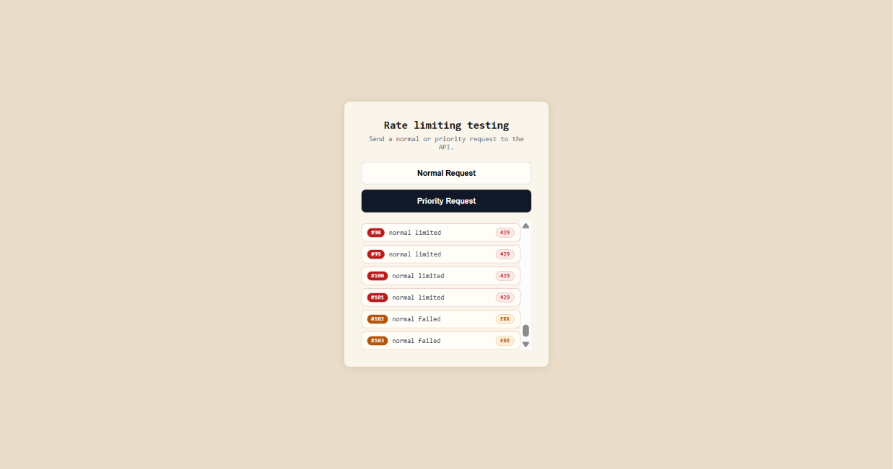

# ratty

> A flexible Express rate-limiting middleware featuring 5 swappable algorithms backed by atomic Redis Lua scripts.

   

<p align="center">
  
</p>

---

## Overview

**ratty** is a centralized rate-limiting middleware for Express applications. It protects API backends from traffic surges, brute-force attempts, and resource starvation by enforcing precise client request quotas.

Unlike traditional in-memory rate limiters that break when applications scale horizontally, **ratty** offloads state tracking to Redis and executes decision logic through atomic Lua scripts. It implements all 5 major rate-limiting algorithms, supports both traffic policing and traffic shaping, and allows on-the-fly algorithm swapping without restarting the server.

---

## System Architecture

Following the architectural recommendations, the rate limiter sits as an **API middleware layer** intercepting incoming client requests before they hit downstream application controllers:

```
[ Client Requests ]
         │
         ▼
┌────────────────────────────────────────────────────────┐
│               Express Application Tier                 │
│                                                        │
│  ┌──────────────────────────────────────────────────┐  │
│  │             Rate Limiter Middleware              │  │
│  │  - Client Identifier Extractor (req.ip)          │  │
│  │  - Declarative Rules Evaluator (JSON)            │  │
│  │  - Swappable Algorithm Selector (1–5)            │  │
│  │  - Standard Rate-Limiting Headers Appender       │  │
│  │  - Priority Request Queue Manager                │  │
│  └────────────────────────┬─────────────────────────┘  │
│                           │                            │
└───────────────────────────┼────────────────────────────┘
                            │ Atomic EVAL (Single Round-Trip)
                            ▼
           ┌──────────────────────────────────┐
           │     Centralized Redis Store      │
           │  - Atomic Lua Script Engine      │
           │  - Auto-Expiring TTL Keys        │
           │  - Hashes, Counters, & ZSETs     │
           └──────────────────────────────────┘
```

1. **Client Identification**: Scopes limits per client IP (`req.ip`), ensuring granular per-client quota tracking.
2. **Decoupled Rules Engine**: Rate limits are configured declaratively in an external JSON configuration file ([`rules/rateLimitRules.json`](file:///C:/Users/Administrator/projects/rate-limiter/rules/rateLimitRules.json)).
3. **Centralized Evaluation**: Decision state is synchronized across instances through Redis.

---

## Distributed Rate Limiting Concepts

Scaling a rate limiter across multiple web server nodes introduces two primary distributed systems challenges:

### The Synchronization Challenge

When scaling horizontally across multiple web application servers behind a load balancer, application servers must remain **stateless**:

- **The Problem with In-Memory Counters**: If rate limit counters are stored in local server memory, requests from the same client routed across different servers (`Server 1`, `Server 2`) are tracked independently. A client can easily exceed their intended quota by distributing requests across nodes.
- **Why Sticky Sessions Fall Short**: Using sticky sessions or client affinity to route requests from a client to the same server node breaks stateless horizontal scaling, complicates autoscaling, and causes traffic imbalances when nodes restart.
- **The Centralized Storage Solution**: By storing rate limit counters in a centralized in-memory store (**Redis**), every application node accesses the exact same global state with sub-millisecond read/write latencies and automatic key expiration.

### Concurrency & Race Conditions

In high-concurrency environments, multiple requests from the same client can arrive at different servers simultaneously. A standard Read-Modify-Write pattern creates severe race conditions:

```
Thread / Node 1                 Redis Server                 Thread / Node 2
      │                              │                              │
      │─── 1. GET counter (is 2) ───>│                              │
      │                              │<─── 2. GET counter (is 2) ───│
      │                              │                              │
  Check: 2 < 3 (Limit)               │                          Check: 2 < 3 (Limit)
  Request Allowed                    │                          Request Allowed
      │                              │                              │
      │─── 3. INCR counter (is 3) ──>│                              │
      │                              │<─── 4. INCR counter (is 4) ──│  <-- EXCEEDED!
```

Both threads observe the counter below the threshold and allow both requests, violating the rate limit.

Using distributed locks (such as Redlock or Redis mutexes) avoids this race condition but introduces substantial synchronization latency, lock contention, and throughput bottlenecks.

### The Lua Script Approach

To guarantee 100% thread safety without distributed locks, **ratty** executes all check-and-update logic inside **Redis Lua scripts (`EVAL`)**:

1. **Guaranteed Atomicity**: Redis executes Lua scripts within a single-threaded context. No other command or script can interleave during execution. Reading the current count, computing token refills or sliding window bounds, incrementing values, and setting TTLs occur in a single atomic step.
2. **Single Network Round-Trip**: Rather than performing multiple round-trips over the network (`GET` -> evaluate -> `SET` -> `EXPIRE`), the entire evaluation runs on the Redis server in **one round-trip**, significantly reducing latency.
3. **Deterministic TTL Expiration**: All keys are assigned Time-To-Live (TTL) timestamps directly inside the scripts, ensuring stale keys are pruned automatically without background garbage collection tasks.

### Cluster Sharding Support (Hash Tags)

In sharded Redis Cluster environments, multi-key operations (such as checking both current and previous windows in the Sliding Window Counter) require that all evaluated keys map to the **same hash slot**.

**ratty** utilizes **Redis Hash Tags (`{...}`)** on multi-key commands:

```javascript
keys: [`{${key}}:${currWindow}`, `{${key}}:${prevWindow}`]
```

Redis hashes only the content inside `{...}`, guaranteeing that both keys hash to the same cluster slot and node.

---

## The 5 Rate Limiting Algorithms

### 1. Token Bucket
- **Concept**: A bucket holds up to `BUCKET_SIZE` tokens and refills at a steady rate (`refill_rate = capacity / unit`). Each incoming request consumes 1 token.
- **Lua Implementation**: Reads a Redis Hash containing `tokens` and `last_refill`. Calculates tokens generated since the last request based on timestamp difference: `elapsed = now - last_refill`, `new_tokens = elapsed * refill_rate`. Tops up the bucket to capacity, decrements 1 token if available, updates the hash, and sets the TTL.
- **Characteristics**: Highly memory-efficient; easily accommodates **short bursts of traffic** as long as tokens are present in the bucket.

### 2. Sliding Window Log
- **Concept**: Tracks the precise timestamp of every admitted request within a sliding time window.
- **Lua Implementation**: Backed by a Redis Sorted Set (`ZSET`). Automatically prunes expired timestamps older than `now - window` via `ZREMRANGEBYSCORE`, inspects the current log size via `ZCARD`, and inserts the new timestamp via `ZADD`. Calculates the exact millisecond retry interval using the oldest entry in the log.
- **Characteristics**: 100% accurate rate limiting; avoids boundary spike vulnerabilities. Requires higher memory because every request timestamp is retained for the duration of the window.

### 3. Leaky Bucket (Policing vs Shaping)
- **Concept**: Requests enter a queue of fixed capacity and drain at a constant, fixed processing rate.
- **Two Operational Modes**:
  - **Traffic Policing (`policing`)**: Drops excess traffic immediately with HTTP 429 once the bucket reaches maximum capacity.
  - **Traffic Shaping (`shaping`)**: Computes the exact schedule delay (`delay_ms`) based on virtual queue depth and defers execution asynchronously with `setTimeout()`, smoothing bursty client traffic into a steady, constant-rate outflow.
- **Characteristics**: Ideal for protecting sensitive downstream services that require stable, predictable throughput.

### 4. Fixed Window Counter
- **Concept**: Divides the timeline into fixed-size windows (e.g., 10 seconds) and tracks a single integer counter per window.
- **Lua Implementation**: Increments the window counter atomically via `INCR` and sets the TTL on the first request.
- **Characteristics**: Extremely fast and minimal memory footprint. Subject to the **boundary burst problem**, where traffic clustered around the edge of two adjacent windows can permit up to 2x the allowed limit in a short timeframe.

### 5. Sliding Window Counter
- **Concept**: A hybrid algorithm that combines the minimal memory footprint of the Fixed Window Counter with the smoothness of the Sliding Window Log.
- **Approximation Formula**:
  $$\text{Estimated Count} = (\text{Previous Window Count} \times (1 - \text{Elapsed Percentage})) + \text{Current Window Count}$$
- **Lua Implementation**: Reads both the current and previous window counts using cluster-safe hash tags, computes the weighted estimate, and atomically increments the current window if within quota.
- **Characteristics**: Minimal memory usage (only 2 integer keys) while eliminating boundary burst spikes with ~99% accuracy.

---

## Algorithm Comparison Matrix

| Algorithm | Redis Data Structure | Memory Overhead | Accuracy | Burst Tolerance | Downstream Protection |
| :--- | :--- | :--- | :--- | :--- | :--- |
| **Token Bucket** | Hash (`tokens`, `last_refill`) | Very Low | High | Excellent (up to capacity) | Balanced |
| **Sliding Window Log** | Sorted Set (`ZSET`) | High | 100% Exact | Strict rolling window | High |
| **Leaky Bucket (Policing)** | Hash (`level`, `last_leak`) | Very Low | High | Rejects bursts | High |
| **Leaky Bucket (Shaping)** | Hash (`next_free`) | Very Low | High | Queues with delay | Maximum (constant outflow) |
| **Fixed Window Counter** | Integer String (`INCR`) | Minimal | Low at boundaries | Vulnerable (2x at edge) | Low |
| **Sliding Window Counter** | 2 Integer Strings (`{key}:w`) | Very Low | ~99% Approximation | Smooths boundaries | High |

---

## HTTP Status Codes & Response Headers

When a client exceeds the configured rate limit, the middleware returns:
- **HTTP Status Code**: `429 Too Many Requests`
- **Response**: Serves a styled HTML notification page ([`public/err/rate-limited.html`](file:///C:/Users/Administrator/projects/rate-limiter/public/err/rate-limited.html)) or JSON error payload.

Standard rate-limiting headers (conforming to RFC 6585 and industry conventions) are attached to responses:

| Header | Description | Example |
| :--- | :--- | :--- |
| `X-Ratelimit-Limit` | Maximum allowed requests within the active window. | `3` |
| `X-Ratelimit-Remaining` | Remaining request quota available before throttling. | `1` |
| `X-Ratelimit-Retry-After` | Wait time in seconds (or ms) before retrying. | `10` |

---

## Traffic Tiering & Priority Queue

**ratty** supports dual-tier request handling to distinguish between regular client traffic and high-priority / VIP operations:

- **Normal Traffic** (`/api/normal` or `Priority: 0`):
  - Subject to immediate quota enforcement.
  - Returns `429 Too Many Requests` when quota is exhausted.
- **Priority Traffic** (`/api/priority` or `Priority: 1`):
  - When rate limits are reached, priority requests are routed to an internal **Priority Request Queue** (`priorityReqQueue`) to be processed safely as capacity permits rather than dropped.

---

## Runtime Algorithm Switching & Interactive Shell

When the application starts, an interactive terminal selector allows swapping between algorithms dynamically without stopping the server:

```text
═══════════════════════════════════════════════
  Server is running
  URL       : http://localhost:8000
═══════════════════════════════════════════════

Which type of ratelimiter you wish to use ?
 Press 1 for Token Bucket
 Press 2 for Sliding Window Log
 Press 3 for Leaky Bucket
 Press 4 for Fixed Window Counter
 Press 5 for Sliding Window Counter
```

- When selecting **Option 3 (Leaky Bucket)**, the console prompts:
  `Press 1 for shaping or anything for policing` to toggle between traffic smoothing and immediate rejection.

---

## Engineering Trade-Offs & Scaling Considerations

When planning large-scale deployments, consider the following architectural adjustments:

1. **Fail-Open vs. Fail-Closed Fallback Strategy**:
   - In the event of a Redis connectivity interruption, rate limiters can either **fail open** (allow requests through and fire operational alerts to prevent taking down the API) or **fail closed** (return HTTP 503 to protect backend services). Wrapping Redis calls in an explicit fallback handler ensures predictable behavior.
2. **Reverse Proxy & Client IP Resolution**:
   - In production environments behind Cloudflare, AWS ALB, or NGINX, configure `app.set('trust proxy', true)` in Express so that `req.ip` reflects the true client IP from `X-Forwarded-For` rather than the load balancer's internal IP.
3. **Script Caching at Scale (`EVALSHA`)**:
   - For high-throughput services processing tens of thousands of requests per second, pre-loading Lua scripts at startup with `redisClient.scriptLoad()` and executing via `EVALSHA <sha>` avoids repeatedly transmitting script bodies over the network.
4. **Distributed Priority Queues**:
   - For distributed deployments across multi-node clusters, pairing the priority queue mechanism with a distributed message broker (such as Redis Streams, RabbitMQ, or Amazon SQS) ensures queue persistence and coordinated worker consumption across instances.
5. **Traffic Shaping & Socket Limits**:
   - In Leaky Bucket shaping mode, holding connections open with `setTimeout` smooths traffic. Ensure upstream reverse proxy timeouts (e.g., NGINX `proxy_read_timeout`) are configured higher than maximum expected shaping delays.

---

## Quickstart & Testing

### Prerequisites
- Node.js (v18+)
- Redis instance running (default: `redis://localhost:6379`)

### 1. Installation
```bash
git clone https://github.com/pandey-kun7/rate-limiters.git
cd rate-limiters
npm install
```

### 2. Configure Environment
Ensure `.env` contains your Redis connection URL:
```env
REDIS_URL="redis://localhost:6379"
```

### 3. Start the Server
```bash
npm start
```

Select your desired algorithm in the terminal prompt.

### 4. Interactive Browser Dashboard
Open **`http://localhost:8000`** in your browser. The live testing dashboard allows triggering normal and priority requests, viewing live HTTP status badges, and inspecting remaining budget counters in real time:

<p align="center">
  
</p>

### 5. cURL Testing
```bash
# Normal request (throttled when over limit)
curl -i http://localhost:8000/api/normal

# Priority request (VIP tier)
curl -i -H "Priority: 1" http://localhost:8000/api/priority
```

---

## Configuration & Directory Structure

Rate limits are configured in [`rules/rateLimitRules.json`](file:///C:/Users/Administrator/projects/rate-limiter/rules/rateLimitRules.json):

```json
[
  {
    "title": "Token Bucket Rate Limit",
    "type": "tokenBucketRateLimit",
    "rate-limit": {
      "unit": 10,
      "requests_per_unit": 3
    }
  }
]
```

- `unit`: Time window duration in seconds.
- `requests_per_unit`: Maximum requests allowed per window.

```text
rate-limiter/
├── .env                             # Redis connection URL
├── index.js                         # Application entrypoint & CLI selector
├── package.json
├── README.md                        # Documentation & architecture guide
├── controllers/
│   └── serve.controller.js          # Route response handlers
├── middleware/
│   └── rateLimiter.js               # 5 Lua scripts, Redis evaluation & middleware
├── public/
│   ├── err/
│   │   └── rate-limited.html        # HTTP 429 response template
│   ├── html/
│   │   └── index.html               # Interactive browser testing dashboard
│   └── images/
│       └── download.jpg
├── redis/
│   └── client.js                    # Redis client initialization & connection
├── routes/
│   └── serve.route.js               # Endpoint routing (/api/normal, /api/priority)
└── rules/
    └── rateLimitRules.json          # Declarative rate limit configuration
```

---

## License

ISC License
